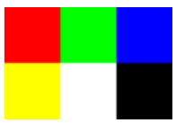
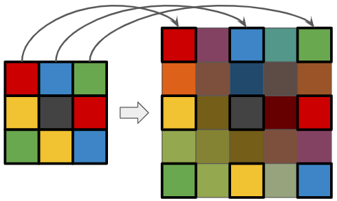
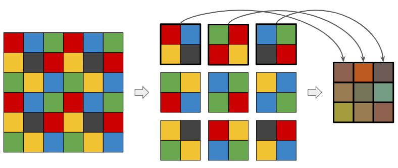
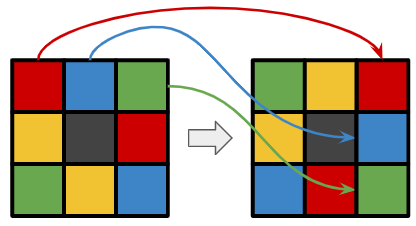
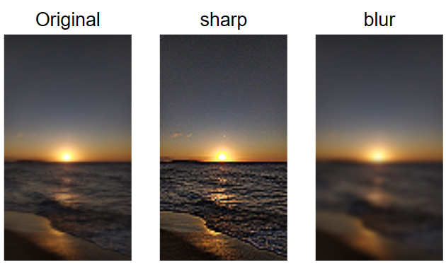
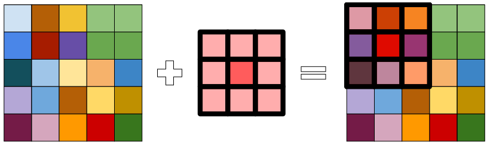

[](https://classroom.github.com/a/USrsknXW)
# Processamento de imagens

Processamento de imagem é qualquer processo de transformação de dados no qual a entrada e saída são imagens, tais como fotografias ou quadros de vídeo. Neste projeto, você irá criar um programa que realize transformações simples em imagens. Ele deverá realizar as seguintes operações:
* Transformação de uma imagem colorida em escada de cinza;
* Ampliação/redução de uma imagem (2x);
* Rotação de uma imagem (90 graus);
* Aplicação de filtros de difusão (blurring) e de nitidez (sharpening).

Para a realização do projeto, faz-se necessário apresentar alguns conceitos básicos de processamento de imagem, a começar como elas são representadas em arquivos e depois como essas representações podem ser manipuladas.

## Representações de imagens através de bitmaps

Imagens digitais são normalmente representadas de duas formas: ou vetorial ou raster. A primeira usa figuras geométricas (como polígonos, circunferências, entre outros) para definir objetos a serem usados na composição da imagem. A segunda forma é uma representação em que há uma correspondência de cada pixel da imagem a um conjunto de informações (como cor, transparência etc.). Dizemos que esta última forma é uma representação “ponto-a-ponto” da imagem, normalmente realizada através de uma matriz onde cada célula contém a informação de um ponto, também conhecida como “mapa de bits” ou bitmap.

O tamanho da matriz define a resolução da imagem, normalmente especificada através da quantidade de colunas e de linhas. Por exemplo, a resolução 640 x 480 indica uma imagem cuja matriz possui 640 colunas e 480 linhas, e portanto 307.200 pontos de informação (pixel).

Quando desejamos armazenar, transferir ou imprimir essa imagem, faz-se necessário armazená-la em um arquivo. A representação da imagem no arquivo não utiliza necessariamente a mesma representação da imagem em memória, ou seja não é necessariamento um bitmap. Isso porque a representação em memória procura facilitar e tornar as operações de manipulação da imagem eficientes, enquanto a representação em arquivo é normalmente voltada à compactação da imagem (tamanho do arquivo) com ou sem perdas de qualidade.

No presente projeto, você irá manipular uma imagem a partir de um arquivo em um formato próximo ao usado em memória. É um formato simples encontrado nos ambientes Linux, chamado PPM (Portable Pixmap).

**Obs:** Como o formato PPM foi definido no Linux e o Windows tem seu "concorrente" (.bmp), não há suporte nativo no Windows para abrir arquivos PPM. Se você estiver trabalhando no Windows, você pode instalar um software de visualização de imagem, como o [IrfanView](https://www.irfanview.com/). Porém, uma forma independente de Sistema Operacional é instalar uma extensão no Visual Code que dê suporte às imagens PPM, por exemplo [PBM/PPM/PGM Viewer for Visual Studio Code](https://marketplace.visualstudio.com/items?itemName=ngtystr.ppm-pgm-viewer-for-vscode).

## Formato de imagem PPM

O formato de imagem PPM possui diferentes versões. Na versão a ser usada neste projeto, o arquivo de imagem se encontra no formato de texto (outros usam um modo binário) e cada pixel é definido por três valores inteiros, indicando a intensidade dos componentes das cores vermelho (R), verde (G) e azul (B).

O arquivo PPM obedece a uma formação específica composta por um cabeçalho, com informações sobre a imagem em geral, seguido de uma sequência com os valores RGB para cada um dos pixels. A função do cabeçalho é identificar que se trata de uma imagem PPM, da versão utilizada, as dimensões da imagem e o valor máximo da intensidade de cada cor.

Para ilustrar melhor, a figura e conteúdo a seguir exemplificam uma imagem (ampliada para ser melhor exibida) com dimensões de 3x2 representada na versão do formato PPM que iremos utilizar (versão P3).



```
P3
3 2
255
255 000 000   000 255 000   000 000 255
255 255 000   255 255 255   000 000 000
```

A primeira linha contém o identificador P3. Esse identificador serve para os programas que leem arquivos de imagem saber que o conteúdo a seguir adotam o formato textual do PPM. Em seguida, os valores 3 e 2, separados por espaço, indicam respectivamente a largura e altura da imagem (ou seja, tem 3 colunas e 2 linhas). Na terceira linha está o valor 255. Esse valor é usado para informar o valor máximo de cada componente do pixel e indica, de certa forma, o nível de qualidade da imagem: quanto maior o valor, maior a quantidade de cores representáveis.

As demais linhas do arquivo se referem aos valores RGB dos pixels da imagem. Ou seja, a cada 3 valores, um novo pixel é definido. O primeiro pixel é o do canto superior esquerdo da imagem. O seguinte é o segundo pixel na mesma linha, e assim por diante até a largura da imagem. Ao término da primeira linha, a próxima tripla de valores define o primeiro pixel da segunda linha, e assim por diante até o final da imagem.

Neste projeto, os arquivos de imagem utilizarão sempre o formato PPM P3 com o valor de qualidade fixo em 255. As dimensões podem, entretanto, variar.


## Transformações de imagens

### Transformação em escala de cinza

Em uma imagem em escala de cinza, os componentes R, G e B de todos os seus pixels possuem o mesmo valor, indicando a não predominância de uma cor sobre as outras. Por exemplo, [R = 50, G = 50 e B = 50] representa um cinza escuro, [R = 250, G = 250 e B = 250] representa um cinza claro e [R = 150, G = 150 e B = 150] um cinza médio. 

Assim, uma das abordagens mais simples para transformar uma imagem colorida em escala de cinza é calcular a média dos componentes RGB de cada pixel (C = (R+G+B/3)) e atribuir esse valor aos componentes RGB do pixel (R = G = B = C).

### Ampliação da imagem

Normalmente, quando ampliamos uma imagem, ela perde a nitidez, uma vez que as informações dos pixels ficarão mais "distantes". Há vários métodos para minimizar essa perda. Porém, iremos utilizar uma versão simples, onde os pixels são espaçados de exatamente uma linha e uma coluna, criando assim uma imagem com praticamente o dobro de tamanho da original.

Os valores intermediários entre os pixels espaçados serão definidos em função da média dos componentes RGB de dois adjacentes. Por exemplo, na ampliação da imagem à esquerda da figura abaixo, o pixel que ficará no espaçamento entre o pixel vermelho (R=204, G=0, B=0) e o amarelo (R=241, G=194, B=50) será laranja (R=222, G=97, B=25).



## Redução da imagem

A redução da imagem neste projeto será semelhante à ampliação. Você irá remover o espaçamento entre linhas e colunas. Porém, ao invés de simplesmente remover linhas e colunas, cada pixel da nova imagem será a junção de um "quadrado" de 4 pixels da imagem original. Essa "junção" será calculada a partir da média dos componentes de cada 4 pixels. Por exemplo, os valores RGB dos 4 pixels que formam o quadrado superior esquerdo da imagem à esquerda da figura abaixo serão usados para calcular os valores RGB (usando a média) do pixel superior esquerdo da imagem à direita. Os próximos 4 para calcular o pixel seguinte e assim por diante.



Caso a largura ou a altura da imagem seja ímpar, a última coluna ou última linha de pixels da imagem original será desconsiderada (não será usada na geração da imagem reduzida).

## Rotação

A rotação a ser feita será de 90º no sentido horário, fazendo com que o pixel do canto superior esquerdo da imagem original passe ao canto superior direito na imagem rotacionada, como ilustra a figura abaixo.



Perceba que, na rotação, as dimensões da imagem são trocadas. A rotação de uma imagem com dimensão 640 x 320 resultará em uma imagem de 320 x 640.

## Aplicação de filtros

Aplicação de filtros é uma técnica de processamento de imagens que normalmente manipula os valores de uma vizinhança para modificar a imagem. Esta técnica é normalmente utilizada para destacar, suavizar e/ou remover determinadas características da imagem. Podemos, por exemplo, aumentar o contraste dos pixels vizinhos ou deixá-los mais difusos, como ilustrados na figura a seguir, em que os filtros de sharpening e blurring foram aplicados.



Para a aplicação de filtros, é necessário utilizar uma "máscara" que percorre os pixels da imagem realizando as transformações sobre eles. Essa máscara é definida por uma matriz cujos valores são "pesos" (importância) dos pixels durante a transformação. Normalmente, as matrizes são quadradas de tamanho ímpar (ex: 3x3, 5x5, 7x7, ...) indicando a área de influência dos vizinhos sobre um pixel.

Ao aplicar um filtro 3x3, estamos indicando que os pixels adjacentes a um determinado pixel irão influenciar sua nova cor. A figura abaixo ilustra a aplicação de uma máscara 3x3 sobre o pixel (1,1) de uma imagem 5x5. Perceba que o pixel (1,1) está no centro da máscara e todos seus adjacentes influenciam sua nova cor. O mesmo ocorre quando a máscara for aplicada ao pixel (1,2), depois ao pixel (1,3) e assim por diante.



Em função dos valores na matriz, podemos transformar a imagem de diferentes formas. As matrizes a seguir correspondem às imagens apresentadas acima na aplicação dos filtros de sharpening e blurring.

```math
\begin{pmatrix}
 0 & -1 &  0\\ 
-1 &  5 & -1\\ 
 0 & -1 &  0
\end{pmatrix}
```
*Matriz para o filtro de sharpening*.

```math
\begin{pmatrix}
1/9 & 1/9 & 1/9 \\ 
1/9 & 1/9 & 1/9 \\ 
1/9 & 1/9 & 1/9 
\end{pmatrix}
```
*Matriz para o filtro de blurring*.

Como os valores da máscara são "pesos", esses valores serão multiplicadores dos valores RGB de cada pixel. Por exemplo, se aplicarmos a máscara de sharpening acima no pixel (1,1) de uma imagem, o valor de seu componente R do pixel será 5x o valor de seu R menos a soma dos valores R de seus adjacentes ortogonais (horizontal e vertical). Veja que, como os cantos da matriz valem 0, os adjacentes diagonais não irão influenciar na cor resultante. Na matriz de blurring acima, o valor de cada componente (R, G e B) será a média dele e seus adjacentes.

# O Programa

Seu programa deve receber como argumento o nome da transformação a ser realizada, podendo ser:
* `gray`: para criar uma nova imagem em escala de cinza;
* `enlarge`: para ampliar a imagem em 2x;
* `reduce`: para reduzir a imagem em 2x;
* `rotate`: para rotacionar a imagem em 90º no sentido anti-horário;
* `sharp`: para aumentar a nitidez da imagem (aplicar o filtro de sharpening);
* `blur`: para reduzir a nitidez da imagem (aplicar o filtro de blurring).

Os dados da imagem original devem ser lidos da entrada-padrão (`cin`) no formato PPM P3 e os dados da nova imagem (após a transformação) devem ser enviados para a saída-padrão (`cout`).

Digamos, por exemplo, que seu programa (após compilado) se chame `procimg` e você queira rotacionar a imagem `imgs/galinhos.ppm` gerando uma nova imagem chamada `imgs/rotate.ppm`. Você irá então executar:

```sh
$ ./procimg rotate < imgs/galinhos.ppm > imgs/rotate.ppm
```

Esse comando indicará que a transformação desejada é `rotate`, que a leitura de dados da entrada-padrão será feita a partir do arquivo `imgs/galinhos.ppm` e que, ao invés do resultado ser enviado para o terminal, ele será enviado para um novo arquivo chamado `imgs/rotate.ppm`.

Neste projeto, seu programa não precisa tratar imagens de qualquer tamanho. Considere que as imagens a serem manipuladas terão dimensões de no máximo 128 pixels. Essa restrição irá facilitar a implementação da solução.

Na pasta `imgs`, há um conjunto de imagens para você testar sua solução. As imagens `gray.ppm`, `enlarge.ppm`, `reduce.ppm`, `rotate.ppm`, `sharp.ppm` e `blur.ppm` são resultantes das transformações correspondentes sobre a imagem `galinhos.ppm`, que tem dimensão 72 x 128 pixels.

Caso queira ver se as saídas de seu programa são iguais aos arquivos de exemplo, utilize o utilitário `diff` do Linux. Por exemplo:

```sh
$ diff imgs/rotate.ppm my_rotate.ppm
```

Se nenhuma linha diferente for apresentada, é porque a operação foi implementada corretamente. Nas transformações com aplicação de máscaras, atente para as bordas das imagens. Se a máscara ultrapassar os limites da imagem, use o pixel da borda.

Seu projeto deverá ser submetido via git até a data indicada na turma no Github Classroom.

# Critérios de avaliação

A nota correspodente ao projeto seguirá os critérios e distribuição abaixo:
* Atendimento dos requisitos do projeto: 7,0
  * Leitura e escrita da image: 1,0
  * Transformação em escala de cinza: 1,0
  * Apliação da imagem: 1,0
  * Redução da imagem: 1,0
  * Rotação da imagem: 1,0
  * Aplicação de filtros: 2,0
* Organização da solução: 3,0
  * Uso adequado de funções: 1,0
  * Uso padrões em relação a nomes, identação etc.: 1,0
  * Documentação do código: 1,0

## Observações

* O projeto deve ser desenvolvido individualmente ou em dupla. Não serão permitidos grupos com três ou mais alunos.
* Cada dupla deve desenvolver sua solução de forma independente das demais. Soluções idênticas serão consideradas plágios e, portanto, sanções serão devidamente aplicadas em todas as duplas com soluções similares.
* Caso algum trecho de código seja utilizado da web ou gerado via IA, essa informação deve estar presente na documentação do projeto.
* A solução apresentada poderá usar recursos de C++ além dos que foram apresentados em sala de aula. Porém, não haverá pontuação adicional por isso.
